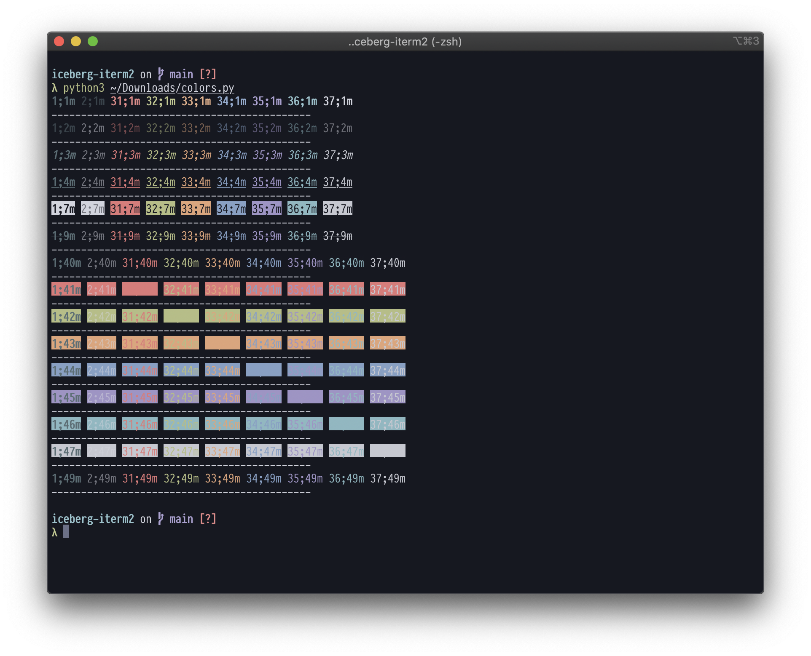
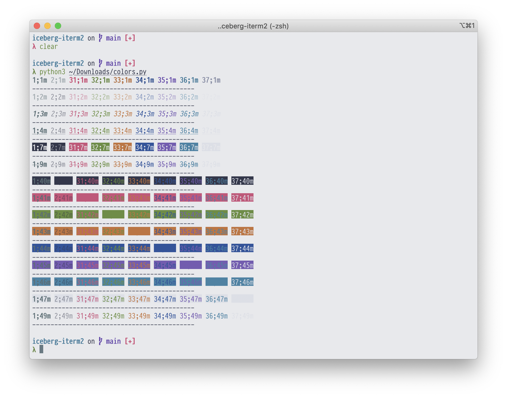

# Iceberg for `iterm`

> Unofficial port of iceberg.vim colorscheme

Dark scheme

Light scheme

Text settings from screenshot:

- Font [PragmataPro Mono Liga](https://fsd.it/shop/fonts/pragmatapro/)
- Font size 14

### Other

- [Original iceberg.vim](https://github.com/cocopon/iceberg.vim)

## License

MIT License, 2020
